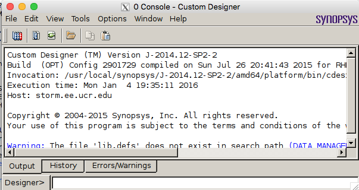

# Pre-Lab

## ENGR account

ENGR account is different than your UCR NetID. It's not combination with number (tkim049, this is UCR NetID). If you never activate your ENGR account or you have an ENGR account but you forgot your password, then please visit [here](https://www.engr.ucr.edu/secured/systems/login.php) and create your one.

For GPP/UCR Extension students, please email to systems@engr.ucr.edu with the following information

Name
Student type: IEP or GPP
Extension ID
UCR NetID
Gmail address

## ENGR X-windows systems access

### Windows

The college provides three computational servers for student use both on and off campus. This computational servers provide our IC design toolchains.

To access these servers on Windows, you must first download and install an SSH client (putty) and an X Server (Xming).  Once you have finished downloading the links below.

In our lab (WCH125), you can use PUTTY and you need to use with XMing.

An official ENGR SSH/Xming instruction can be found at [ here ](http://systems.engr.ucr.edu/tutorials/computational.html)

For putty instruction can be found at [ here ](http://www.geo.mtu.edu/geoschem/docs/putty_install.html)

You need to run `Xming` first and then `putty` later

### OSX/Linux

For OSX/Linux, you don't need to install SSH/Xwindows tools as these are default softwares in these operating systems.

We will use `storm.engr.ucr.edu` server thru SSH with X-forwarding service.

For OSX/Linux, you can type following command in your terminal,

`ssh -Y [ENGRID]@storm.engr.ucr.edu`

For example

`ssh -Y tkim@storm.engr.ucr.edu`

## Check Synopsys Galaxy Custom Designer Launch

We already preconfigured every IC design environment, so you don't need to set any environment. You can check toolchain is correctly working. Once you login `storm.engr.ucr.edu`, you can check if Synopsys tool is working correctly by typing the following command.

`cdesigner&`

Once you see the following screen, then it's ready for next lab.

If you have any question, then you can post your question at issue section in this github.
