# Lab/Tutorial 3

In this tutorial, some contexts use Synopsys tutorials from Vazgen Melikyan (Synopsys) and Hamid Nahmoodi (SFSU). All the tools and PDK are given thru Synopsys University Program.

## Introduction

In this tutorial, you will learn how to do parasitic extraction/ post layout simulation and hierarchical design. You will use your Inverter design for your parasitic extraction and post layout simulation. For your hierarchical design, you will eventually design Ring Oscillator. You need to check off until Ring Oscillator.

This work design for two weeks lab, so for your lab report, you need to design 4-bit binary full adder schematic, layout (DRC,LVS pass) and post layout simulation, which requires Hierarchical Design skill. The 1-bit adder requires 5 NAND gates.

## Part 9: Parasitic Extraction (continues from lab1 and lab2)

You need to keep working on Inverter schematic and layout for this extraction.

From your lab2, after passing DRC and LVS you can now move on to LPE (Layout Parasitic Extraction). In this phase, resistances and capacitances will be extracted from the layout. In layout window go to Verification -> LPE -> Setup and Run. Please make sure your setup the Fig. 66 for the Main tab.


_**Fig. 66. LPE Setup for StarRC**_

In Fig 66, you need to click the "View output" Option to see the output window.

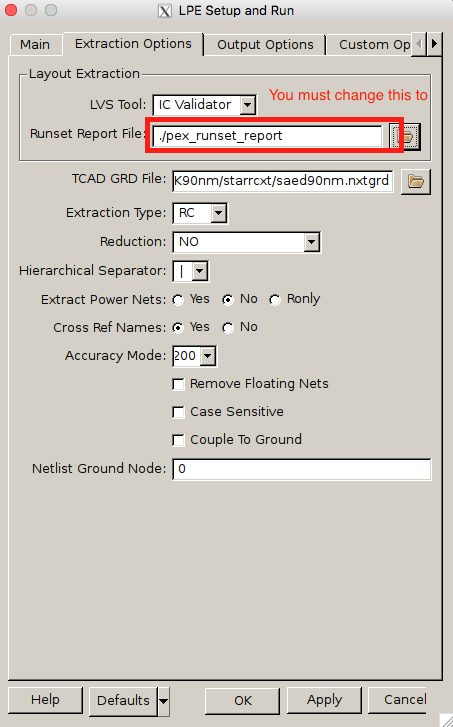

_**Fig. 67-0. LPE Setup for StarRC**_

In Fig67, 'Extraction Options' tab, you need to your `Runset Report File` to yours. It is located under `pvjob_[your library name]_[your cellview name].icv.lvs` folder.


_**Fig. 67-1. LPE Setup for StarRC**_

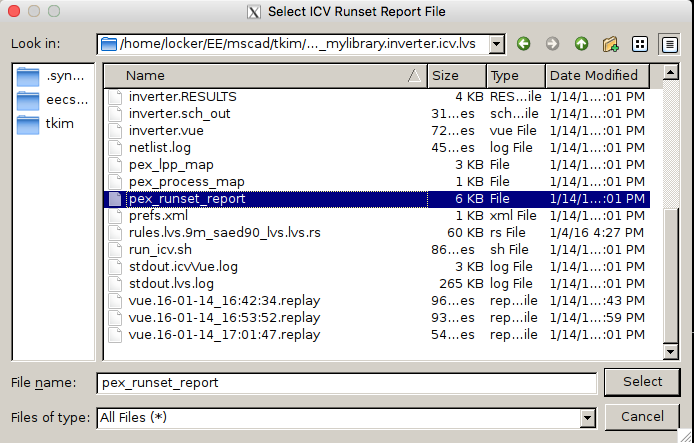

_**Fig. 67-2. LPE Setup for StarRC**_


_**Fig. 67-3. LPE Setup for StarRC**_

In Fig67-3, you should choose your ground node. You chose 'AVSS' for our ground. So put this.


_**Fig. 68. LPE Setup for StarRC**_

Make sure the other options in this tab match up with Fig 67-0,1,2,3, and Fig 68.

Device Map:
```
/usr/local/synopsys/pdk/SAED_PDK90nm/starrcxt/device_map
```
Layer Map:
```
/usr/local/synopsys/pdk/SAED_PDK90nm/starrcxt/output_layer_map
```

Now click on OK. Then you will see Customer Designer as Fig. 69.


_**Fig. 69. Console Output**_

After some time you should able to see the following message as shown in the console window if the parasitics were generated correctly. See Fig 70.


_**Fig. 70. Console Output**_

After LPE has successfully run, a parasitic view window should open. See Fig 71 and 72 for reference. The RC components are very small in the window that opens up (Fig 71) so you may need to zoom in to see the details (Fig 72). It may help to drag a box around the RC components using the mouse cursor to highlight them, then zoom in to see them. Also note that your parasitic view may not match exactly as shown below which is fine since this depends on differences in layout


_**Fig. 71. Parasitic View**_


_**Fig. 72. Parasitic View Zoom In**_

You have successfully generated the parasitic view for the inverter and are ready to run post layout simulation. Save the parasitic view with Design -> Save. The parasitic view will be saved as “starrc” for the view name.


## Part 10: Post Layout Simulation

After parasitic extraction we want to apply the parasitics to the schematic for a more accurate representation of our inverter and test it. From the Custom Designer Console window go to File -> Open Design and open the inverter circuit schematic created earlier.

Select the following options for the following columns: Libraries: mylibrary

Cells: inverter_schematic

Views: schematic


See Fig 73 for reference. Once all options are highlighted, click Open and the schematic that was created earlier for testing the inverter will open, see Fig 74 for reference.

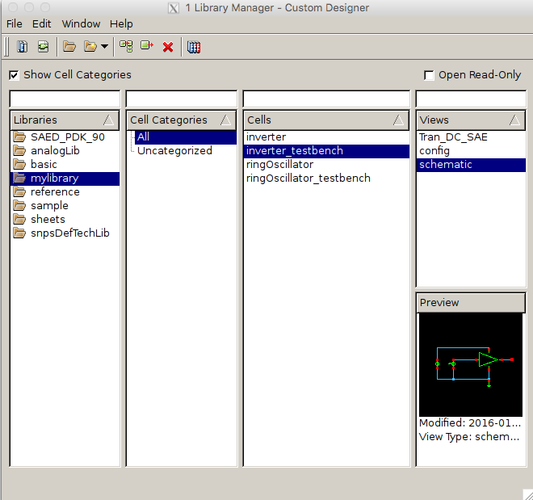

_**Fig. 73. Opening Circuit with Inverter Schematic**_


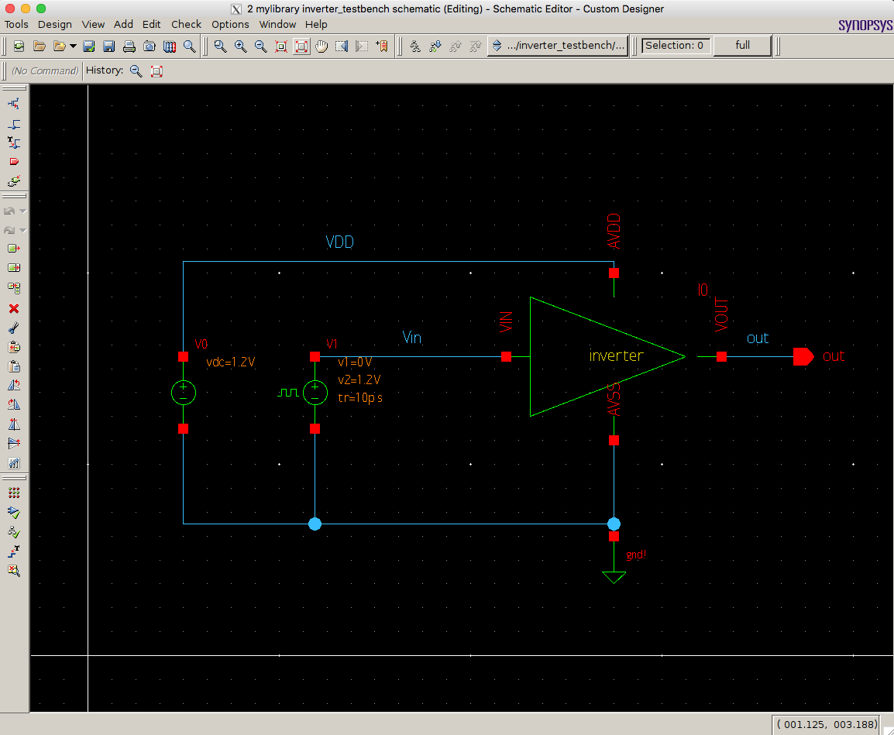

_**Fig. 74. Testbench Circuit for Inverter**_

After opening the testbench circuit, make sure the circuit is similar to the one shown in Fig 74. Now the parasitics need to be loaded into the inverter cell used in the circuit. From the Custom Designer Console window, go to File -> New -> CellView.
In the New CellView window, create a new configurations file as follows:

- Select inverter_testbench for the cell.

- Set view name to config

- Set editor to HE – config

See Fig 75 below for reference and click OK.

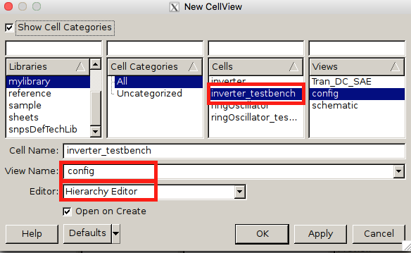

_**Fig. 75. Configurations File Setup**_

A Hierarchy Editor window will display. Setup the view and list options as noted in Fig 76 below.

- View: schematic

- View Search List: schematic hspice symbol

- View Stop List: symbol

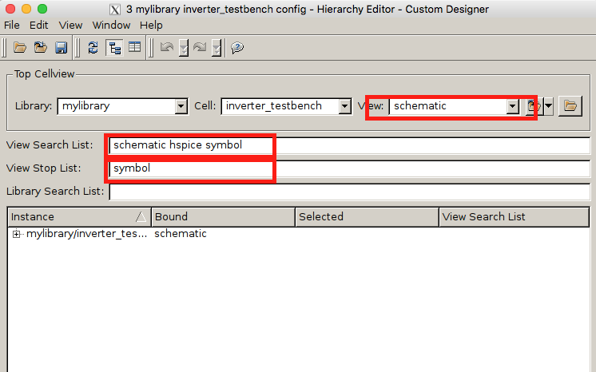

_**Fig. 76. Hierarchy Editor**_

In order to map the parasitics generated from LPE to your inverter cell, select starrc under the 'Selected' column for the inverter instance, see Fig 77 for reference. The format for your inverter instance name in the instance column is schematic_instance_name (mylibrary, inverter). Notice that as starrc is selected, resistor and capacitor instances will show up under the instance column, this substitution replaces the inverter cell with its equivalent schematic containing its resistive and capacitive components. Afterwards save the settings by going to File -> Save.
For future reference, to apply parasitics for a general case, a schematic must have its equivalent schematic symbol and layout created since a layout is used to generate the parasitics and a schematic symbol is used as a vessel to hold the parasitics. The testbench schematic is created to test the symbol containing the schematic with its applied parasitics.


_**Fig. 77. Loading Parasitics into the Inverter**_

To start simulation with parasitics, go to File -> Open Design from the Custom Designer Console window. In the Open Design window that opens, select inverter_testbench under the cells column and config under the views column and right click on config under views. Select Open Design from the drop down menu. See Fig 78 below for reference.

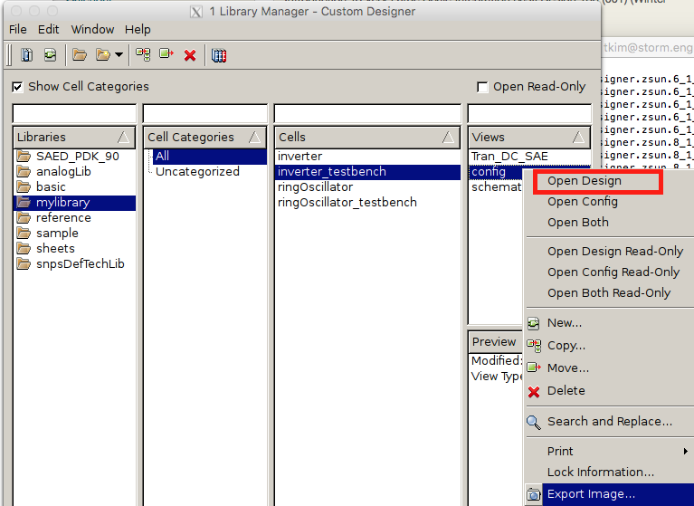

_**Fig. 78. Open Design with Parasitics**_

Afterwards, a schematic view should open up with parasitics applied, see Fig 79 below for reference. To check if the parasitics were applied, you can double click on the inverter symbol/cell and it should display the same parasitics view that was generated from running LPE. To change between parasitic and schematic views, select the desired view in the yellow box noted in Fig 79.

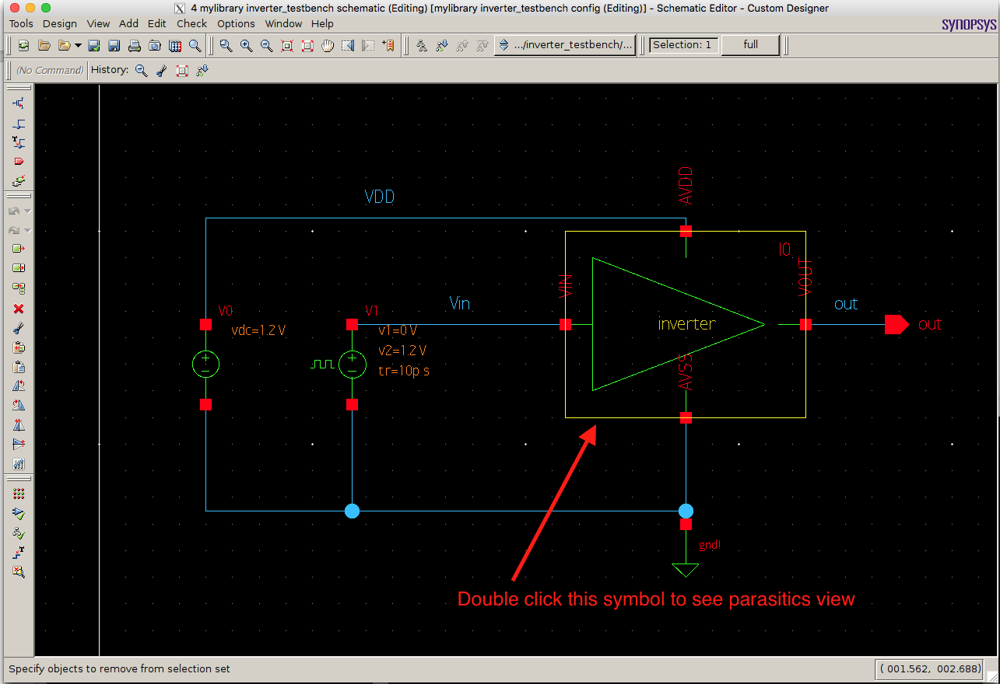

_**Fig. 79. Schematic with Parasitics Applied to the Inverter**_


_**Fig. 80. Simulation result with parasitic extraction**_

Now go ahead and simulate your circuit as you did previously in Part 3 of the tutorial. From the schematic window, go to Tools -> SAE to open a new SAE window. When comparing the two waveforms (inverter parasitics to inverter without parasitics) take note of the difference between delays from VIN to VOUT for transient waveforms. The result can be seen in Fig 80.


__Tip__:
If there is a mismatch error in the console regarding mismatched nets that are uppercase and lowercase between parasitics (starrc) and the symbol when running the SAE simulation, set all pin names to use uppercase letters in schematic and set all layout labels to use uppercase letters as well. After this change, you need to run LVS, LPE, regenerate the inverter symbol, redo the configurations file for the testbench, and rerun the SAE.


## Part 11: Hierarchical Design - (Last tutorial)

Using smaller instances of circuits to create a larger design is what hierarchical design is all about. In this section, we use an inverter we created earlier and use several instances of it to create a five stage oscillator in schematic and layout views.

Create a new schematic for the ring oscillator by going to New -> CellView from the Custom Designer Console and setup the options as shown in figure 81 below. The setup is as follows:

- Library: mylibrary
- Cell Name: ringOscillator
- View Name: schematic
- Editor: Schematic Editor

Click OK when done.

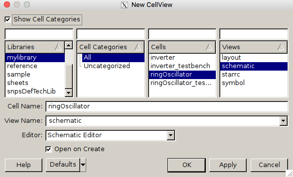

_**Fig. 81. Ring Oscillator Schematic Setup**_

In the schematic window, building a ring oscillator circuit with pins as shown below in Fig 82.
For the inverter instances, look for them in Add -> Instance to open the add instance window. In the add instance window, choose `mylibrary` for library, inverter for cell, and symbol for the view and place five instances of the inverter on the schematic.

Add wires with Add -> Wire.

For the pins, go to Add -> Pins and place two input pins for the AVDD and AVSS signals, and place five input/Output pins at each inverter output. For the five input/output pins, I called them VIO1-5 in the schematic. Feel free to give the wires the same names as the pins using Add -> Wire Name. Also as a convention, use uppercase letters for pin names instead of lowercase letters.

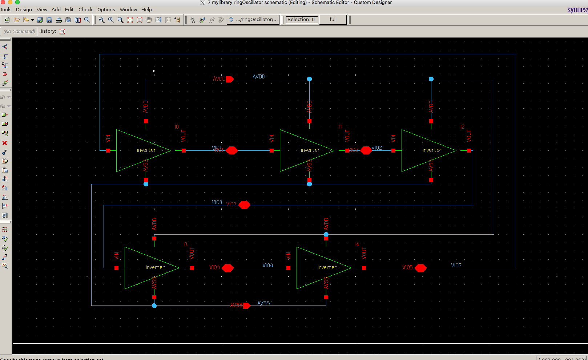

_**Fig. 82. Ring Oscillator Schematic**_

Save your schematic using Design -> Save. Now create a symbol of your inverter using Design -> New CellView -> From CellView. Make sure your options match up as shown below in Fig 83 and click OK.

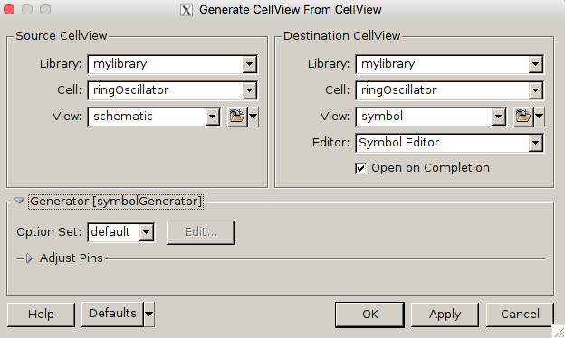

_**Fig. 83. Ring Oscillator Symbol Setup**_

After clicking OK, a new schematic window opens up with the ring oscillator symbol. Feel free to move around the pin placements for a better pin organization. See Fig 84 below for reference. Save the symbol when done with Design -> Save.

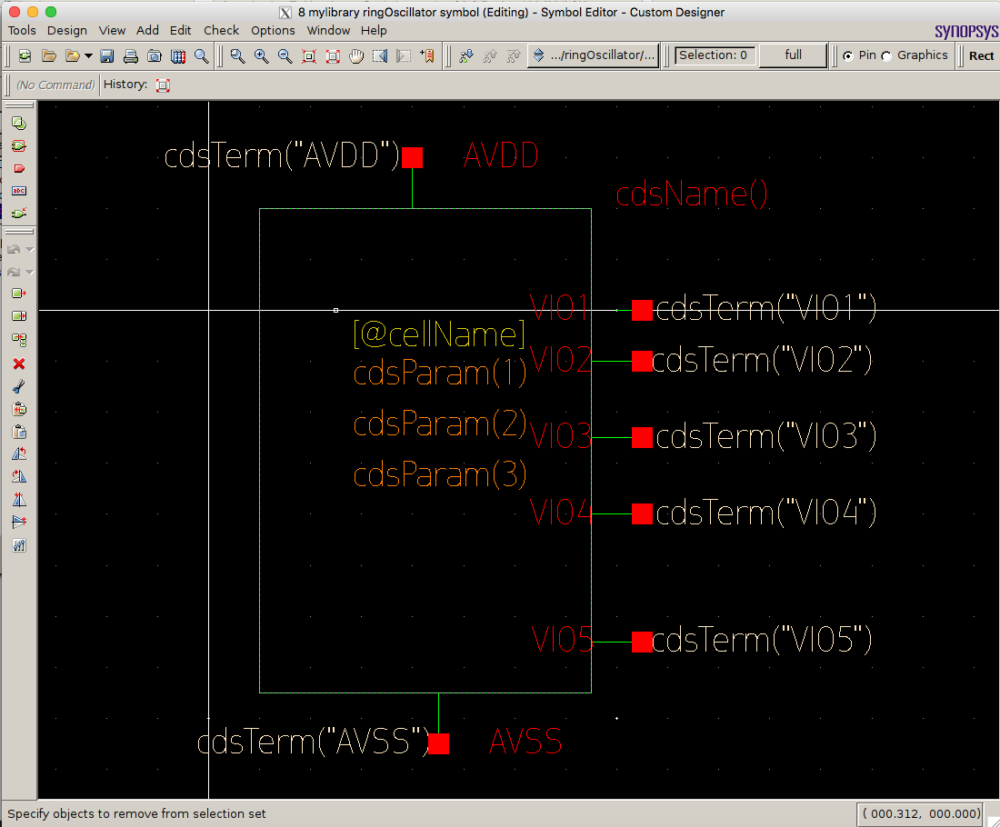

_**Fig. 84. Ring Oscillator Symbol**_

Now create a new schematic to use as a testbench for the ring oscillator by going to New -> CellView from the Custom Designer Console and setup the options as shown in Fig 85 below. The setup is as follows:

- Library: mylibrary
- Cell Name: ringOscillator_testbench
- View Name: schematic
- Editor: SE - schematic


_**Fig. 85. Ring Oscillator Testbench Setup**_

Afterwards a new schematic window should open. In the new schematic window, setup the ring oscillator testbench circuit as shown in Fig 86.
To place a ringOscillator instance, look for them in Add -> Instance to open the add instance window. In the add instance window, choose mylibrary for library, ringOscillator for cell, and symbol for the view and place an instance of your ring oscillator on the schematic. Also place an instance of ground and a voltage source in the schematic. You can find these instances under library: analogLib and cell: gnd and cell: vsource respectively. For the voltage source, set the voltage to 1.2 volts.

Add wires with Add -> Wire.

For the pins, go to Add -> Pins and place five output pins for each of the five `VIO#` pins. Feel
free to give the wires the same names as the pins using Add -> Wire Name.

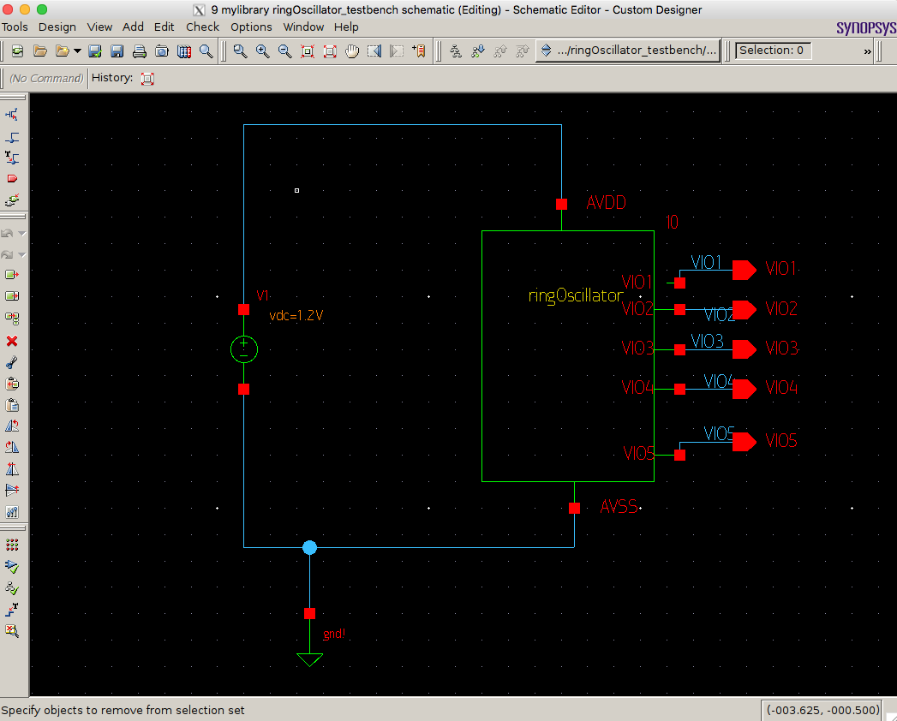

_**Fig. 86. Ring Oscillator Testbench Circuit**_

Save with Design -> Save once your testbench circuit is done. Now we need to create a new layout so go to New -> CellView from the Custom Designer Console and setup the options as shown in Fig 87 below.

- Library: mylibrary
- Cell Name: ringOscillator
- View Name: layout
- Editor: Layout Editor
Click OK when done.


_**Fig. 87. Ring Oscillator Testbench Circuit**_

In the new layout window, we can use the layout of the inverter created earlier to build a ring oscillator circuit. Go to Create -> Instance to open up a new create instance window. In the window select mylibrary for library, inverter for cell, and layout for the view and place five instances of the inverter layout on the layout screen. See Fig 88 for reference.

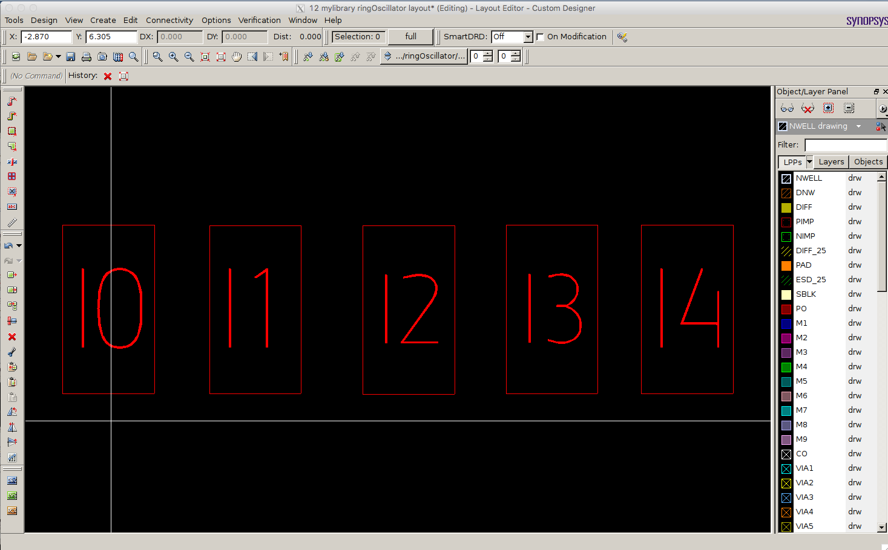

_**Fig. 88. Placing Five Inverter Layout Instances**_

Notice that the layout components for the inverter layouts don’t display. This is because the inverter layouts are hiding one level up in the hierarchy. In order to view them, change the hierarchy bounds as shown in Fig 89 below. The numbers represent a range of hierarchy levels that are displayed where the left number is the lower limit and the right number is the higher limit. Afterwards the inverter layouts are viewable as shown in Fig 90.


_**Fig. 89. placing Five Inverter Layout Instances**_

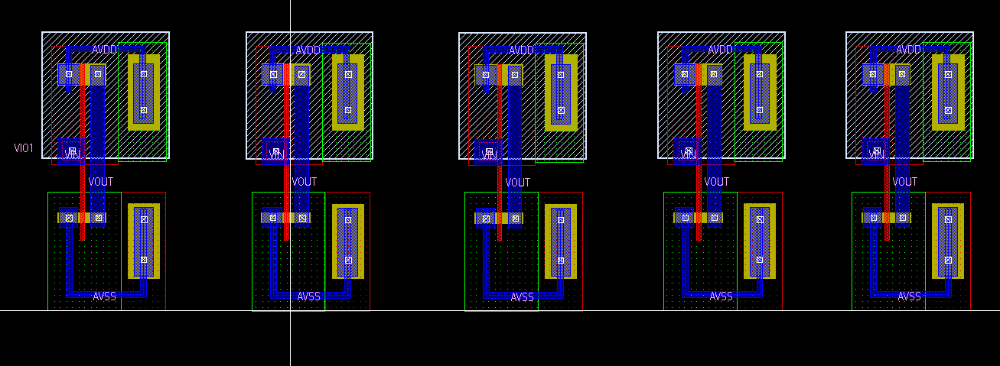

_**Fig. 90. Viewing Inverter Layout Instances**_

Now draw metal paths with Create -> Path using the M1 layer under the LPP panel. Connect all AVDD signals with a single M1 connection and all AVSS signals with a single M1 connection. Also connect the output of an inverter to the input of the next inverter using the M1 layer. See Fig 91 for M1 connections.

In addition you need to add labels for the metal connections just added. To add labels, select the M1PIN layer in the LPP panel and go to Create -> Text -> Label. Enter a name for each label in the box noted in Fig 92 and place the text labels as noted by the red boxes in Fig 91. Label names used are: AVDD, AVSS, VIO1, VIO2, VIO3, VIO4, and VIO5. Remember that in order to pass LVS, your M1PIN label names in layout need to match up with the pin names from your ring oscillator schematic. Also names for schematic pins and names for layout labels should use uppercase letters. Save the layout.

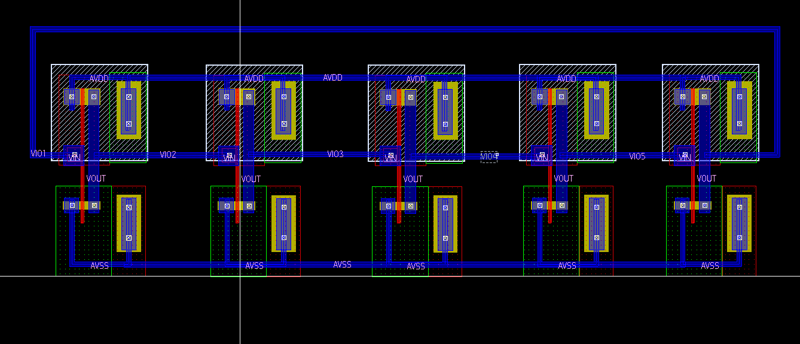

_**Fig. 91. Ring Oscillator Layout**_


_**Fig. 92. Label Text**_

After your layout matches Fig 91, go to Verification -> DRC -> Setup and Run to setup and run DRC (as done earlier in lab2 of the tutorial). Your options for DRC should match Fig 93. Leave the options on the custom tab as their defaults. Click OK when done.

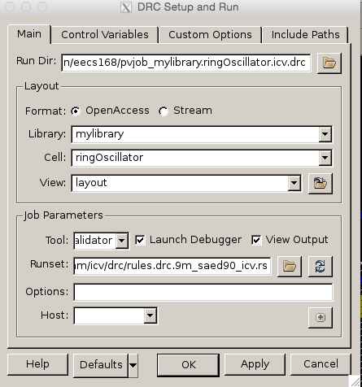

_**Fig. 93. DRC Setup**_

Debug any DRC errors that come up. When DRC is passed, continue on to Verification -> LVS -> Setup and Run to run LVS. In LVS, setup the options as shown in Fig 94 and Fig 95 and leave the defaults for the custom options tab. Click OK when done.

Under main option select the file “rules.lvs.9m_saed90.ev” as `Run Dir` in the following directory:

```
[under your project folder]/pvjob_mylibrary.ringOscillator.icv.lvs
```

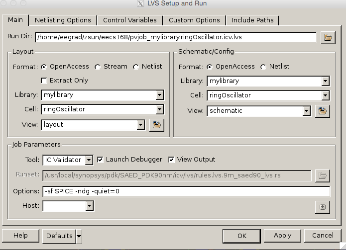

_**Fig. 94. LVS Setup**_

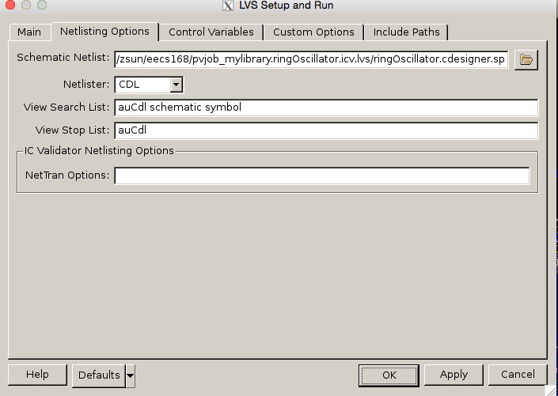

_**Fig. 95. LVS Setup**_

At this point if there are any LVS errors, an error window will show up. Debug any errors you have and rerun LVS until you pass it. After running LVS successfully, go to Verification -> LPE -> Setup and Run to run parasitic extraction.

See Fig 96 below for reference on setups.

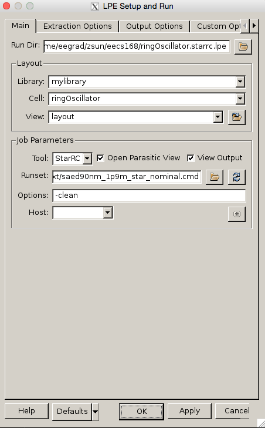

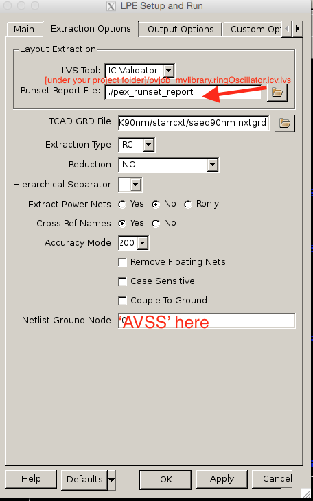

_**Fig. 96. LPE Setup**_


Under the Output Options tab make sure that you have the same setup as shown in Fig. 97. Make sure the following map files are set as noted below if not already set by default.


Leave the custom options tab with their set defaults. Click OK when done.

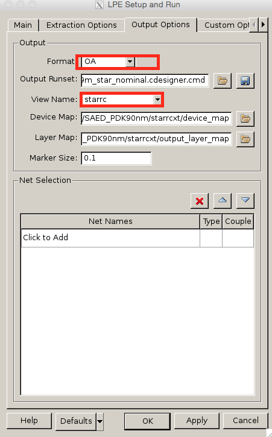

_**Fig. 97. LPE Setup**_

If LPE ran successfully, a parasitics view will open up. The parasitics are small so drag a box over it with a mouse cursor and zoom in to see individual components if you don’t see it at first. See Fig 98 below for reference. Afterwards save the parasitics view with Design -> Save.


_**Fig. 98. Parasitics View**_

After parasitic extraction, create a new configuration files by going to File -> New -> CellView in the custom designer console. Setup the options as noted in Fig 99 to setup a configurations file for the ring oscillator testbench. Click OK when done.

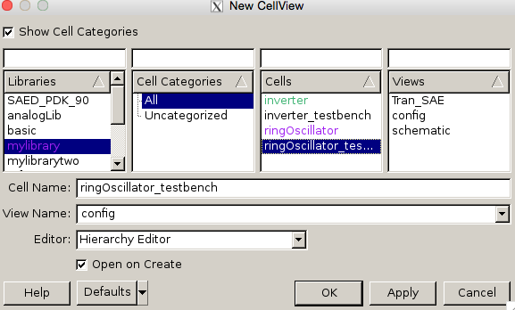

_**Fig. 99. Configurations File Setup**_

A new configurations file will open up. From here, setup the options as noted in Fig 100 to load the ring oscillator parasitics into the ring oscillator symbol. Save with File -> Save when done.

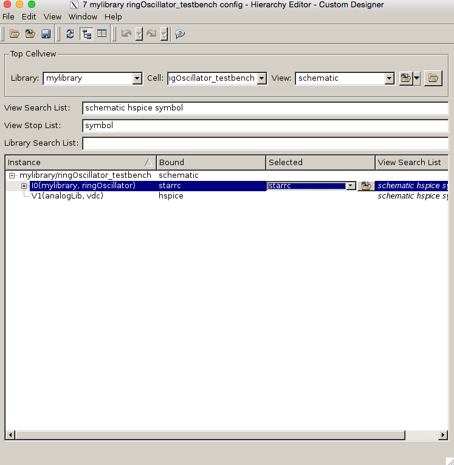

_**Fig. 100. Configurations File Setup**_

To start simulation with parasitics, go to File -> Open Design from the Custom Designer Console window. In the Open Design window that opens, select ringOscillator_testbench under the cells column and config under the views column and right click on config under views. Select Open Design from the drop down menu. See Fig 101 below for reference.

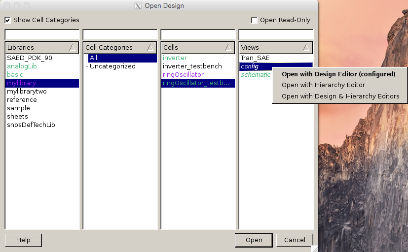

_**Fig. 101. Open Design with Parasitics**_

Afterwards a schematic window opens up with the ring oscillator testbench circuit created earlier, see Fig 102 for reference. To check if the parasitics were properly loaded into the ring oscillator, double click the ring oscillator symbol and the parasitics view generated from LPE earlier should display.


_**Fig. 102. Ring Oscillator Testbench Circuit**_

From the ring oscillator testbench window, you can simulate the circuit by using SAE as noted in part 3 of the tutorial. To open SAE, go to Tools -> SAE from the schematics window and setup the simulation for a transient analysis and plot the voltages for the VIO1, VIO2, VIO3, VIO4, and VIO5 voltages. For the transient analysis setup in SAE, use 1ps for step time and 1ns for stop time.

Side Notes for Using Convergence Aids to Initialize Voltages:
Also note that it may be helpful to give a wire in the circuit an initial voltage before running simulation. This particular setup applies to circuits such as a five stage ring oscillator circuit shown in Fig 103. In addition to the setup noted in part 3 for SAE, before running the simulation, go to Setup -> Convergence Aids in the SAE window.


_**Fig. 103. Where to Click on Schematic for Node Setup in Ring Oscillator**_

Setup the options as noted in Fig 104 below. You may need to setup multiple initial voltages to drive the inverters since one initial voltage may not be enough to drive the entire ring oscillator. It is suggested that you setup at least two initial voltages using alternating voltages of 0 and 1.2 for consecutive inverter nodes in the ring oscillator circuit. See Fig 105 for multi- node initialization and see Fig 103 on where to click in the schematic for node setups. Click OK, when done and run the simulation as noted in part 3 of the tutorial in Fig 106


_**Fig. 104. Setting up Convergence Aids**_

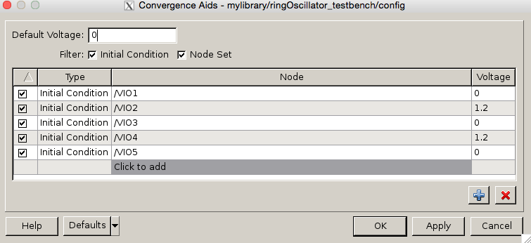

_**Fig. 105. Setup for Multiple Initial Voltages**_


_**Fig. 106. Simulation result for ring oscillator**_


You have now finished transient simulation of the ring oscillator circuit with applied parasitics.

### Extra tutorial for use multiple layer

- Using M2 Layer (or higher like M3, M4...) in Layout

For designs that require require an extra metal layers in layout, designers can use a metal layer higher up (like M2) to make connections if the lower metal layers (like M1) are too constricting to allow any other connections.
In the ring oscillator layout, M1 (blue layer) is replaced with M2 (pink layer). See Fig 107 for reference (Ring Oscillator with M2 layer). Also note that M1 layers can run under M2 layers without physically connecting unless there is a VIA1 layer in between them.

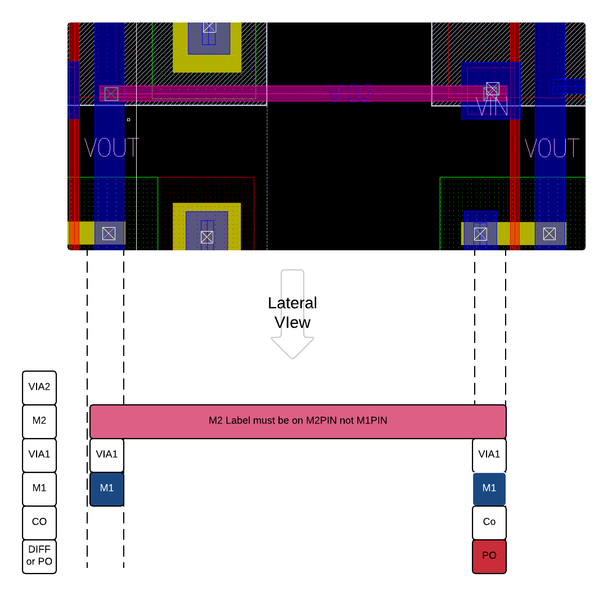

_**Fig. 107. Multiple layer (M2) example**_

In order to connect different layers to each other, all metal layers and contacts/VIAs must exist in between them. For example, to connect a metal 2 layer (M2) to diffusion (DIFF), a contact layer (CO), metal 1 layer (M1), and a VIA1 layer must exist between them. See figure 107 for reference. Also see figure 106 in circle A for a layout drawing example.
To use higher metal layers not shown, use their corresponding VIA layers to interconnect between the desired layers. For example, to connect M2 to M3, a VIA2 layer/contact must be drawn in between them.

Contact (CO) size 0.13um x 0.13um but VIA1 size is 0.14um x 0.14um for 90nm design.

## Lab3

### Objective

Lab3 is to learn how to do parasitic extraction/ post layout simulation and hierarchical design. You will use your Inverter design for your parasitic extraction and post layout simulation. For your hierarchical design, you will eventually design Ring Oscillator. You need to check off until Ring Oscillator.

This lab is designed for two weeks, so for your lab report, you need to design `4-bit binary full adder` schematic, layout (DRC,LVS pass) and post layout simulation, which requires Hierarchical Design skill. The 1-bit adder requires 9 NAND gates. Inputs are A, B, CIN and outputs are S and COUT.

### Deliverables for your lab report.

* Name, SID, Session(021,022), ENGR ID, UCR NetID, your partner name

* Summary of what you learned thru this lab (One paragraph)

* Your inverter parasitic view in Fig 71.

* Your post simulation result in Fig 80.

* Your 1-bit full adder schematic

* Your 4-bit full adder schematic (with using hierarchical design)

* Your 1-bit full adder layout

* Your 4-bit full adder layout (with using hierarchical design)

* An DRC Result with `no errors` for your 4-bit full adder

* An LVS Result with `CLEAN` for your 4-bit full adder

* Your 4-bit full adder __Schematic SIMULATION__ result - you need to have your test bench

* Your 4-bit full adder __Layout POST SIMULATION__ result (with parasitic extraction) - you need to have your test bench

* Some of the issues if you have (One paragraph)

### What to submit

* Lab report (PDF format)

file name should be following

`lab3-[My UCR NET ID].pdf`

for example, my UCR Net ID is `tkim049`, so filename should be

`lab3-tkim049.pdf`

* Tar and Zip your design folder you made

`cd ~/eecs168` or you made

`tar -cvzf lab3-[My UCR NET ID].tgz ./`

for example, my ucr Net ID is `tkim049`, so do like following

`tar -cvzf lab3-tkim049.tgz ./`

* You need to submit two files (\*.pdf, \*.tgz) in iLearn

### Lab Report Due

* Two weeks.

* eecs168-021: by 11:59pm on 2/22
* eecs168-022: by 11:59pm on 2/18

### Checkoff

* First week: Check off your parasitic extraction and ring oscillator layout and post-simulator

* Second week: Check off your 1-bit full adder layout (DRC, LVS should be okay) and post-simulation

* Three week: Check off your 4-bit full adder layout (DRC, LVS should be okay) and post-simulation

### Next lab

In lab 4 (last one), you will full chip design.
