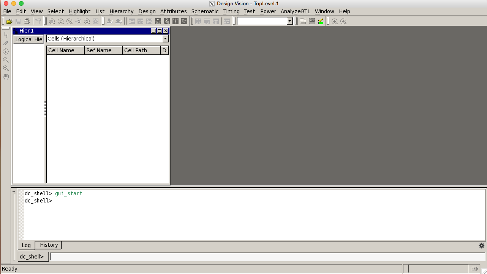

# Lab/Tutorial 4


## Introduction

In this tutorial, you will learn how to do RTL (register transfer level) design to build your circuit with HDL (hardware description language) for EDA (electronic design automation)

This work design for three weeks lab, so for your lab report, you need to design three sets of HDLs, which are 4-bit binary full adder, greatest common devisor (gcd), and finally full-chip design.


In this lab4, we introduce Design Compiler, IC Compiler, VCS RTL Verification solution.

The following figure shows the Synopsys RTL Design following


In this lab, you need to review at least 2 hours for the following website to review your Verilog programming skill, debugging method, and design examples. After 2 hours review, you need to follow RTL design step to make the final layout with design automation process.

For the Verilog editor, `vi` or `emacs` is recommended, but if you're beginner of Linux system, you can use `nano`

## Lab4

Lab4 is 3-week lab and here are the details for given lab

- Lab4-week1: Verilog Review, 4-bit full adder Chip, FSM chip design. (check off: Verilog Review Answer and 4-bit full adder chip RTL simulation and chip layout)

- Lab4-week2: GCD design (check off: GCD RTL simulation and chip layout)

- Lab4-week3: Full-chip synthesis design and layout for Synopsys ChipTop processor (check off: ChipTop processor chip layout)

## Lab4-Week1: Verilog Language Training

Go to the following Verilog tutorial

[Verilog Tutorial](http://vol.verilog.com/VOL/main.htm)

It is recommended for you to review all the chapter, but in this lab4, we will ask you review Chapter 1 to Chapter 5. Chapter 5-9 can be references.

You need to provide all your answers for the each question to get checked off. So please open text file and write down all the answers.

__This lab requires individual lab! You cannot do any parter work anymore.__


## Lab4-Week1: Design Compiler for Synthesis

1. launch dc_shell for design compiler.


_**Fig. 1. Launch Design Compiler**_

1. launch gui_start for design vision, which is GUI interface for design compiler


_**Fig. 2. Launch Design Vision for GUI Version of Design Compiler**_


1. File-> Setup and choose model for your library

- need screen capture

click Link library and choose Link library

/usr/local/synopsys/pdk/SAED90_EDK/SAED_EDK90nm_REF/references/ChipTop/ref/saed90nm_fr/LM/saed90nm_typ.db

Target Library

/usr/local/synopsys/pdk/SAED90_EDK/SAED_EDK90nm_REF/references/ChipTop/ref/saed90nm_fr/LM/saed90nm_typ.db

Symbol Library


/usr/local/synopsys/pdk/SAED90_EDK/SAED_EDK90nm_REF/references/ChipTop/ref/icons/saed90nm.sdb

Now, we need to set logic VDD and VSS

in the dc_shell command shell at the bottom,

```
set mw_logic1_net "VDD"
```

```
set mw_logic0_net "VSS"
```

Write your 4-bit full adder

You need to create new Verilog file, (Fa_4bit.v)
```
module Fa_4bit( cin, cout, ain, bin, sum );

	input cin;
	input [3:0] ain, bin;
	output [3:0] sum;
	output cout;

	assign (cout,sum) = ain + bin + cin;

endmoudle // Fa_4bit
```

Syntax error checking for your Verilog file.

```
analyze -format verilog "Fa_4bit.v"
```

Elaborate your design module

```
elaborate Fa_4bit -architecture verilog -library DEFAULT
```

Link your design module

```
link
```

Check your design module

```
check_design
```

Compile your design module

```
compile
```

After your compilation done, you need to create schematic of the synthesized RTL code.

- Screen capture

Once you click the symbol (Fa_4bit), you can see how it was compiled/synthesized.

We finished the synthesis and we need to generate output file for IC Compiler for layout.

```
write -format ddc -output "Fa_4bit_synthesized.ddc"
```
/
We also need to create gate-level verilog synthesized file.

```
write -format verilog -output "Fa_4bit_synthesized.v"
```

Now, we need to write a design constraint file.

```
write_sdc -nosplit "Fa_4bit_const.sdc"
```

Now, it's time to use IC Compiler, so you need to exit Design Compiler

```
exit
```

## Lab4-Week1: IC Compiler for Placement and Routing Layout

To launch IC Compiler, you need to run the following command in the
linux shell.

```
icc_shell
```

To use GUI interface, you need to run the following command in the
icc shell.

```
gui_start
```


- need screen capture

click Link library and choose Link library

/usr/local/synopsys/pdk/SAED90_EDK/SAED_EDK90nm_REF/references/ChipTop/ref/saed90nm_fr/LM/saed90nm_typ.db

Target Library

/usr/local/synopsys/pdk/SAED90_EDK/SAED_EDK90nm_REF/references/ChipTop/ref/saed90nm_fr/LM/saed90nm_typ.db

Symbol Library

/usr/local/synopsys/pdk/SAED90_EDK/SAED_EDK90nm_REF/references/ChipTop/ref/icons/saed90nm.sdb

Now, we need to create our own library

For the new library path, just click the folder button and choose the
current folder.

File-> Create library and type your new library name "Fa_4bit_icc"

and then, you need to choose Technology file as follows:


```
/usr/local/synopsys/pdk/SAED90_EDK/SAED_EDK90nm_REF/references/ChipTop/ref/tech/saed90nm.tf
```

for input reference libraries, you need to add the following file.

```
/usr/local/synopsys/pdk/SAED90_EDK/SAED_EDK90nm_REF/references/ChipTop/ref/saed90nm_fr
```

make sure open library is checked

Next, you need to set TLU+

File-> Set TLU+

-Figure required

Max TLU+ file:
```
/usr/local/synopsys/pdk/SAED90_EDK/SAED_EDK90nm_REF/references/ChipTop/ref/tlup/saed90nm_1p9m_1t_Cmax.tluplus
```

Min TLU+ file:
```
/usr/local/synopsys/pdk/SAED90_EDK/SAED_EDK90nm_REF/references/ChipTop/ref/tlup/saed90nm_1p9m_1t_Cmin.tluplus
```

Layer name mapping file

```
/usr/local/synopsys/pdk/SAED90_EDK/SAED_EDK90nm_REF/references/ChipTop/ref/tlup/tech2itf.map
```


Now, we can start layout, so we need to import design

File-> Import Designs, choose verilog and click [Add] button to add
synthesized verilog design what we made `Fa_4bit_synthesized.v` and
click okay, then layout window will open below.

Now we can see the standard cells as layout


File->Import Design, choose SDC and import Fa_4bit_const.sdc you
exported from Design Compiler.

File->Save!


Now, we need to create the floorplan. Floorplan -> Create Floorplan

For the spacing bettwen core are and terminals, we can set 10um for
left, right, bottom, and top.


Now, we need to create power-ground network.

Go to Preroute -> Derive Power Ground Connection.

Click Manual connection and put "VDD" in the power net and "VSS" in
the Ground net. Also put "VDD" in the Power pin and "VSS" in the
Ground pin. Create port should be "Top"


Now, we need to write a floor plan.
Go to Floorplan-> Create Floorplan

```
create_floorplan -use_vertical_row -start_first_row -left_io2core 20 -bottom_io2core 20 -right_io2core 20 -top_io2core 20
```

Let's do placement

```
create_fp_placement
```

Now, we
```
synthesize_fp_rail \
  -power_budget "1000" -voltage_supply "1.2" -target_voltage_drop "250" \
  -output_dir "./pna_output" -nets "VDD VSS" -create_virtual_rails "M1" \
  -synthesize_power_plan -synthesize_power_pads -use_strap_ends_as_pads
```

```
commit_fp_rail
```

```
route_opt -initial_route_only
```

```
route_opt -skip_initial_route -effort low
```

```
insert_stdcell_filler \
 -cell_with_metal "SHFILL1 SHFILL2 SHFILL3" \
 -connect_to_power "VDD" -connect_to_ground "VSS"
```
